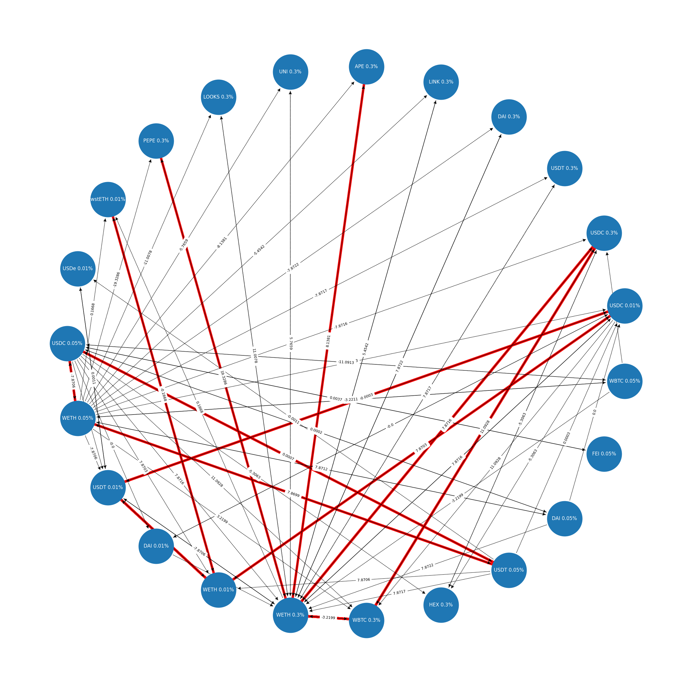

# Defi Arbitration Model


1. [Intorduction](##-Introduction)
1. [Shortest Path Problem](##-Shortest-Path-Problem)
1. [Bellman-Ford Algorithm](##-Bellman-Ford-Algorithm)
1. [Implementation](##-Implementation)
1. [Usage on Uniswap V3](##-Usage-Uniswap-V3)
1. [Results](##-Results)
1. [Complexity](##-Complexity)
1. [POC](##-POC)
1. [Improvements](##-Improvements)
1. [Resources Readings](##-Resources-Readings)

## Introduction

This repository contains analysis of Defi Arbitration as a Shortest Path Problem. The motivation is based on the paper [On the Just-In-Time Discovery of Profit-Generating Transactions in DeFi Protocols](https://arxiv.org/pdf/2103.02228).

The main idea of arbitrage in Defi is to find a path of transaction that can generate profit. We are going to make the following assumptions:

1. Profit is meansured in terms of the amount of the base currency that can be obtained.
2. The transaction is done in a single block.
3. After the transaction, you are left with more base currency than you started with.

The arbitration model is based on the following:

1. A graph `G = (V, E)` where `V` is the set of vertices and `E` is the set of edges.
2. Each vertex `v` represents a token and each edge `(u, v)` represents a transaction from token `u` to token `v`.
3. Each edge `(u, v)` has a weight `w(u, v)` which is the exchange rate from token `u` to token `v`.
4. The goal is to find a path from a source vertex `s` to a destination vertex `t` such that the product of the weights of the edges in the path is greater than 1.

**Pre-requisite**

|     | usd   | eur   | gbp   | chf   | cad   |
| --- | ----- | ----- | ----- | ----- | ----- |
| usd | 1     | 0.741 | 0.657 | 1.061 | 1.005 |
| eur | 1.349 | 1     | 0.888 | 1.433 | 1.366 |
| gbp | 1.521 | 1.126 | 1     | 1.614 | 1.538 |
| chf | 0.942 | 0.698 | 0.619 | 1     | 0.953 |
| cad | 0.995 | 0.732 | 0.650 |       | 1     |

> The arbritation model is based on finding the product summation of exchange rates that is greater than 1. This is equivalent to finding the sum of the log of the exchange rates that is greater than 0.

**Abritrage path with product sum**

$s0 = 10000 usd$

usd -> eur -> cad -> usd

$s1 = 10000 \cdot 0.741 \cdot 1.366 \cdot 0.995 = 10071 $

> You end up with 10071 usd at the end of the transaction, the question is how can we generate this path usd -> eur -> cad -> usd? It's hard to find this path manually by just looking at the table

**Abritrage path with sum of log**

$\log(0.741) + log(1.366) + log(0.995) = 0.00309$

$10000 \cdot 10^{0.0039} = 10071$

> I just wanted to show the equivalence of the two methods. For the sake of the reader I only reference some log properties below but will not go further into the math, read [resources materials](#resources-readings) for detailed on the Arbritration problem.

$log (a) = 0$ if $a = 1$

$log (a) > 0$ if $a > 1$, positive weight

$log (a) < 0$ if $a < 1$, negative weight

$\log (a \cdot b) = \log (a) + \log (b)$

Logarithms convert multiplication into addition, making it easier to work with. In the arbitrage model, we use the sum of the logarithm of exchange rates. The problem of finding the path from `s` to `t` in a graph `G` such that the sum of the weights of the edges in the path is minimized is called the shortest path problem.

## Shortest Path Problem

To find an algorithm suitable for path-finding with negative weights, we need to consider the Bellman-Ford algorithm. Unlike Dijkstra's algorithm, the Bellman-Ford algorithm can handle negative weights effectively.

Additionally, our problem is constrained by the fact that the starting and ending tokens will be the same, and our main focus will be on identifying a negative cycle within the graph.

## Bellman-Ford Algorithm

The Bellman-Ford algorithm is used to find the shortest path from a source vertex `s` to all other vertices in the graph. The algorithm works by relaxing the edges of the graph `|V| - 1` times. If there is a negative cycle in the graph, the algorithm will detect it. The Bellman-Ford algorithm has a time complexity of `O(|V| * |E|)`.

In the context of Defi Arbitraction, we are only interested in token sswapping paths that generates profit, i.e., the negative cycle. We can use the Bellman-Ford algorithm to find the negative cycle in the graph. If there is a negative cycle in the graph, we have found a path that generates arbitrage profit.

## Implementation

The implementation of the Bellman-Ford algorithm is done in Python. The implementation is based on the following steps:

1. Create a graph `G` with vertices and edges.
2. Create a function `bellman_ford` that takes the graph `G`, the source vertex `s`, and it returns the shortest path from `s` to all other vertices in the graph for `|V| - 1` iterations.
3. If after `|V| - 1` iterations any of the edges can be relaxed further, then there is a negative cycle in the graph.
4. Print/Return the negative cycle in the graph
5. Validate transaction execution

## Usage - Uniswap V3

To run the implementation, we can use Uniswap V3 protocol as an example. The following steps can be used:

1. Get the data from Uniswap V3 protocol using any indexer like [The Graph](https://thegraph.com/).
2. Create a directed weighted graph `G` with vertices and edges as ERC20 token pool pairs of the Uniswap V3 protocol
3. Run the `bellman_ford` function with the Defi graph `G` and the source vertex `s` as starting token.
4. If there is a negative cycle in the graph, print the path.

## Results



> Unlike other TradFi Arbitration models that consider different a single asset as the nodes of the graph, the Defi Arbitration model considers the token pairs as the nodes of the graph. This is because the exchange rate between two tokens is not fixed on the token price but on the liquidity pool of the token pair and `feeTier`. You can start with a source token in one pool's `feeTier` and end up with the same token but with more quantity in a different pool. The exchange rate of the token is dymanic and changes with the each liquidity pool so the cycles can be difficult to visualize.

## Complexity

Defi Arbitration as a Shortest Path Problem has a time complexity of `O(|V| * |E|)` which is the same as the Bellman-Ford algorithm. The space complexity is `O(|V|)`.

However, the complexity of the Defi Arbitration model is dependent on the AMM protocol. In using Uniswap V3 as an example, the complexity of the Arbitration model is dependent on the number of token pairs in the Uniswap V3 protocol and for each token pair, the number of `feeTier` and the number of liquidity pools. This poses a challenge in the implementation of the Arbitration model since our nodes and edges increase dramatically with the number of token pairs for each `feeTier` and liquidity pool.

## POC

The Proof of Concept (POC) is implemented in Python. The implementation is based on the Bellman-Ford algorithm. The POC can be found in the `arb.ipynb` notebook.

**Python**

1. Install the required packages

   ```bash
   python3 -m venv venv
   source venv/bin/activate
   pip install -r requirements.txt
   ```

1. Add `api_key` to `.env` file, see [thegrah](https://thegraph.com/) for more information

   ```bash
   cp .env.example .env
   ```

1. Open the [`arb.ipynb`](./arb.ipynb) notebook and run the cells

**Foundry**

Tests are implemented in the `tests` directory. The tests can be run using the following command:

```bash
# I forgot the block number I found this arbitrage, test will fail unless I update fork block number
# vm.createSelectFork("mainnet", 17289404);
# Screenshot of test I ran below
forge test -vvv --match-contract=testPoC
```


## Improvements

1. **Optimization**: The Arbitration model can be optimized by using a more efficient algorithm like the Floyd-Warshall algorithm

1. **Real-time monitoring**: The Arbitration model can be improved by using real-time data from the Defi protocol as each block has a different protocol arbitration state. The Arbitration model is dependent on the data from the Defi protocol. The data collection process can be automated using a low latency indexer

1. **Node Complexity**: the Arbitration model can be improved by reducing the complexity of the Defi protocol graph with different feeTiers and liquidity pools. Since Uniswap V4 has dymanic feeTiers for liquidity pools we will need to use a simpler graph representation for ERC20 token pairs and update our weight function to include the feeTier.

   > Currently with 1000 Uniswap V3 pools our graph looks like this. The center is WETH 3000 feeTier as the most used token pair in V3. The graph is too complex to visualize and the cycles are hard to find. We need to simplify the graph representation or prune unecessary nodes.

   

1. **Transaction Execution**: The Arbitration model can be improved by automating executing the transaction on the Defi protocol by generating transaction parameterss

1. **Integration**: The Arbitration model can be integrated with other Defi protocols to find arbitrage opportunities. In order to scale this the Arbitration model will eventualy need to be independent of the protocol and be interoperable with other Defi protocols e.g. Uniwap V2, Balancer, Curve, Crosschain Protocols like Accross etc.

## Resources Readings

**Defi Makert Arbitration**

- [On the Just-In-Time Discovery of Profit-Generating Transactions in DeFi Protocols, 2021](https://arxiv.org/pdf/2103.02228)

**General Financial Arbitrage**

- [Shortest Paths Arbitrage](https://www.thealgorists.com/Algo/ShortestPaths/Arbitrage)
- [Arbitrage as a Shortest Path Problem](https://blog.skz.dev/arbitrage-as-a-shortest-path-problem)

**Other**

- [Chapter 4.4 Shortest Paths](https://algs4.cs.princeton.edu/44sp/)
